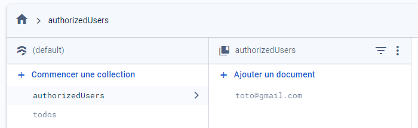
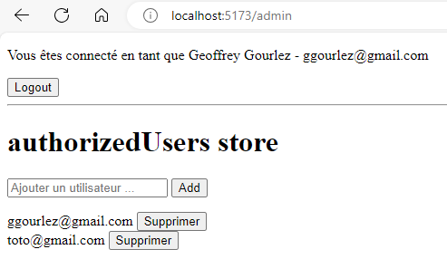
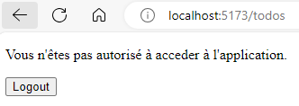

# svelte-firebase-todos-rules-example

Dans cette exemple nous allons voir comment utiliser les règles de sécurité de Firebase pour protéger les données de notre application Svelte.
Nous allons également créer une administration des emails autorisés, c'est une des solution custom possible.

A noter qu'il ne s'agit là que d'un exemple et qu'il existe de nombreuses autres solutions, vous pouvez utiliser une version payante de firebase qui contient déjà la fonctionnalié d'administration des utilisateurs, ou bien utiliser une autre solution de gestion des utilisateurs.

## Prérequis


## Firebase Rules

Les règles de sécurité de Firebase permettent de protéger les données de votre application. Vous pouvez définir des conditions d'accès aux données.

Pour cet exemple, nous allons créer une règle qui permettra de protéger les données des todos. Seuls les utilisateurs authentifiés pourront lire et écrire les données.

Dans la console Firebase, cliquez sur "Firestore Database" dans le menu de gauche, puis sur "Règles" en haut à droite. Remplacez le contenu par le code suivant :

```json
rules_version = '2';

service cloud.firestore {
  match /databases/{database}/documents {
    match /{document=**} {
      allow read, write: if request.auth != null;
    }
  }
}
```

Ici, nous avons défini une règle qui permet de lire et écrire les données si l'utilisateur est authentifié. Cela n'a pas spécialement de sens car n'importe qui pourrait s'authentifier, mais c'est un bon point de départ.

Maintenant imaginons que nous voulons restreindre l'accès à des utilisateurs définits par leur email dans une collection `authorizedUsers`. Nous allons ajouter une règle qui vérifie si l'email de l'utilisateur est présent dans cette collection.

```json
rules_version = '2';

service cloud.firestore {
  match /databases/{database}/documents {
    match /{document=**} {
      allow read, write: if request.auth != null && exists(/databases/$(database)/documents/authorizedUsers/$(request.auth.token.email));
    }
  }
}
```

Ici, nous avons ajouté une condition `exists(/databases/$(database)/documents/authorizedUsers/$(request.auth.token.email))` qui vérifie si le document correspondant à l'email de l'utilisateur connecté existe dans la collection `authorizedUsers`.

Cela devient plus intéressant, car maintenant nous pouvons contrôler l'accès à notre application en ajoutant des documents dans la collection `authorizedUsers`.

## Administration des emails autorisés

Pour ajouter des emails autorisés, nous allons créer une interface d'administration dans notre application Svelte.

Créons une nouvelle page `+page.svelte` dans le dossier `src/routes/admin` :

```svelte
<script>
    import authorizedUsersStore from '$stores/authorizedUsersStore'

    let newauthorizedUser = '';

    const addauthorizedUser = () => {
        if (newauthorizedUser.trim() !== '') {
            authorizedUsersStore.addauthorizedUser(newauthorizedUser);
            newauthorizedUser = ''; // Réinitialiser le champ de saisie après l'ajout
        }
    };

    const deleteauthorizedUser = id => {
        authorizedUsersStore.deleteauthorizedUser(id);
    };
</script>
<h1>authorizedUsers store</h1>

<input type="text" bind:value={newauthorizedUser} placeholder="Ajouter un utilisateur ..." on:keydown={e => e.key === 'Enter' && addauthorizedUser()} />
<button on:click={addauthorizedUser}>Add</button>

<ul>

  {#each $authorizedUsersStore as authorizedUser (authorizedUser.id)}
    <li>
      <span>{authorizedUser.id}</span>
      <button on:click={() => deleteauthorizedUser(authorizedUser.id)}>Supprimer</button>
    </li>
  {/each}
</ul>

    <pre id="json">{JSON.stringify($authorizedUsersStore, undefined, 2)}</pre>

<style>
  ul {
    list-style-type: none;
    padding: 0;
  }
</style>
```

Dans cette page, nous avons un champ de saisie pour ajouter un email autorisé, une liste des emails autorisés et un bouton pour supprimer un email autorisé.
Nous allons également ajouter un store `authorizedUsersStore` pour gérer l'écriture et la lecture des emails autorisés.

Créons un fichier `authorizedUsersStore.js` dans le dossier `src/stores`, puis ajoutons le code suivant afin d'avoir un simple CRUD pour les emails autorisés :

```typescript
import { db } from '$lib/firebase';
import { collection, deleteDoc, doc, getDocs, onSnapshot, setDoc } from 'firebase/firestore';
import { writable } from 'svelte/store'

const authorizedUsersCollection = collection(db, 'authorizedUsers');

const createauthorizedUsersStore = () => {
  const { subscribe, set } = writable([]);

  const fetchauthorizedUsers = async () => {
    const querySnapshot = await getDocs(authorizedUsersCollection);
    const authorizedUsers = querySnapshot.docs.map(doc => ({ id: doc.id, ...doc.data() }));
    return authorizedUsers;
  };

  const fetchauthorizedUsersDocIds = async () => {
    const querySnapshot = await getDocs(authorizedUsersCollection);
    const authorizedUsers = querySnapshot.docs.map(doc => (doc.id));
    return authorizedUsers;
  };

  const addauthorizedUser = async authorizedUser => {
    await setDoc(doc(authorizedUsersCollection, authorizedUser), {});
  };

  const deleteauthorizedUser = async id => {
    await deleteDoc(doc(authorizedUsersCollection, id));
  };

  const unsubscribe = onSnapshot(authorizedUsersCollection, snapshot => {
    const authorizedUsers = snapshot.docs.map(doc => ({  id: doc.id, ...doc.data() }));
    set(authorizedUsers);
  });
  
  return {
    subscribe,
    addauthorizedUser,
    deleteauthorizedUser,
    fetchauthorizedUsers,
    fetchauthorizedUsersDocIds
  };
};

const authorizedUsersStore = createauthorizedUsersStore();
export default authorizedUsersStore;
```

Dans ce store, nous avons ajouté des fonctions pour ajouter et supprimer des emails autorisés, ainsi que pour récupérer la liste des emails autorisés.

Attention, a ce stade il faut bien comprendre que sur la console firebase vous avez activé la règle de sécurité qui permet de lire et écrire dans la collection `authorizedUsers` seulement si l'utilisateur est authentifié. Il faut donc alimenter cette collection avec au moins un email autorisé pour pouvoir accéder à l'application. Vous pouvez faire le test de lancer l'applications sans email autorisé, vous verrez que vous n'aurez pas accès à la liste des todos. Vous pouvez aussi ajouter un autre email que le votre et constater le même résultat.

Dans la console firebase j'ai ajouté un utilisateurs toto pour vérifier que l'accès est bien restreint :


Ajoutez donc votre email dans la collection `authorizedUsers` pour pouvoir accéder à l'application.

Ainsi vous aurez accès à la page d'administration des emails :



## Gestion de l'experience utilisateur quand il n'est pas autorisé

Afin que l'utilisateur non autorisé ne puisse pas accéder à l'application, nous allons ajouter une gestion permetant de rediriger l'utilisateur et de lui afficher un message d'erreur.

Nous allons donc éditer le comportement de notre layout `Layout.svelte` 

On commence par inclue le store `authorizedUsersStore` :

```svelte

	import authorizedUsersStore from '$stores/authorizedUsersStore'

```

Puis un booléen pour savoir si l'utilisateur est autorisé ou non :

```svelte

    let isAuthorized = false;

```

Nous allons ensuite récupérer la liste de tous les emails autorisés dans le store `authorizedUsersStore` et vérifier si l'email de l'utilisateur connecté est présent dans cette liste :

```svelte

    let authorizedUsers = await authorizedUsersStore.fetchauthorizedUsers()
    let authorizedUsersUidsList = authorizedUsers.map((authorizedUser) => authorizedUser.id)
    isAuthorizedUser = authorizedUsersUidsList.includes(user?.email || '')

```

Si l'utilisateur n'est pas autorisé, nous allons le rediriger vers la page d'accueil :

```svelte

    if (!isAuthorized && !nonAuthRoutes.includes(currentPath)) {
        window.location.href = "/";
        return;
    }

```

Enfin nous adaptions le bloc de connexion pour gérer le cas où un utilisateur est authentifié mais non autorisé :

```svelte

{#if user}
	{#if isAuthorized}
		<p>Vous êtes connecté en tant que {user.displayName} - {user.email}</p>
		<button on:click={logout}>Logout</button>
		<hr />
		<main>
			<slot />
		</main>
	{:else}
		<p>Vous n'êtes pas autorisé à acceder à l'application.</p>
		<button on:click={logout}>Logout</button>
	{/if}
{:else}
	<p>Vous n'êtes pas connecté.</p>
	<button on:click={loginWithGoogle}>Login with Google</button>
{/if}


```

Si je supprime mon email de la collection `authorizedUsers` et que je me connecte à l'application, je suis redirigé vers la page d'accueil avec un message d'erreur :




## Conclusion

Dans cet exemple, nous avons vu comment utiliser les règles de sécurité de Firebase pour protéger les données de notre application Svelte. Nous avons également créé une administration des emails autorisés pour contrôler l'accès à l'application.

Il existe de nombreuses autres solutions pour gérer l'accès à une application, vous pouvez utiliser une version payante de Firebase qui contient déjà la fonctionnalité d'administration des utilisateurs, ou bien utiliser une autre solution de gestion des utilisateurs.
